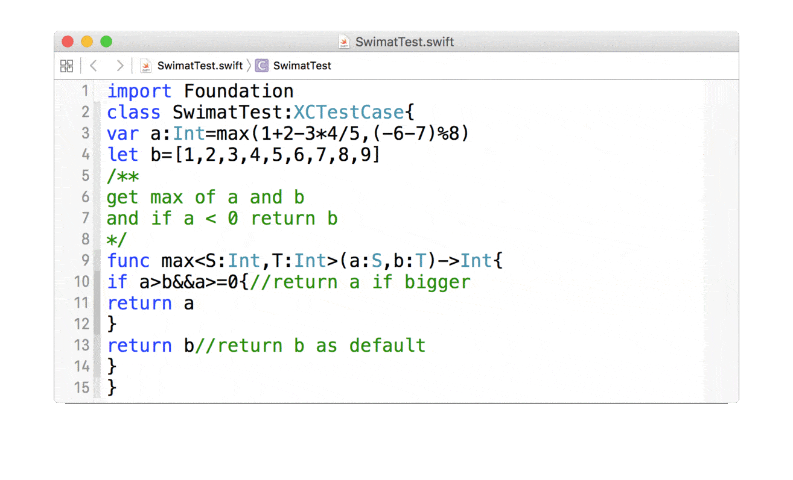

# Swimat

An Xcode plug-in to format your swift code.

## Preview

## Installation

There has two way to install

1. Use [Alcatraz](https://github.com/mneorr/Alcatraz) to install and manage Plug-ins.

2. Clone this repo, build and restart Xcode.

If you encounter any issues you can uninstall it by removing the `~/Library/Application Support/Developer/Shared/Xcode/Plug-ins/Swimat.xcplugin` folder.

## Usage

In the menu open **[Edit] -> [Swimat]** or press hot-key(command+option+shift+L).

## Contributing

Bug reports and pull requests are welcome on GitHub at https://github.com/Jintin/Swimat.

## License

The module is available as open source under the terms of the [MIT License](http://opensource.org/licenses/MIT).
