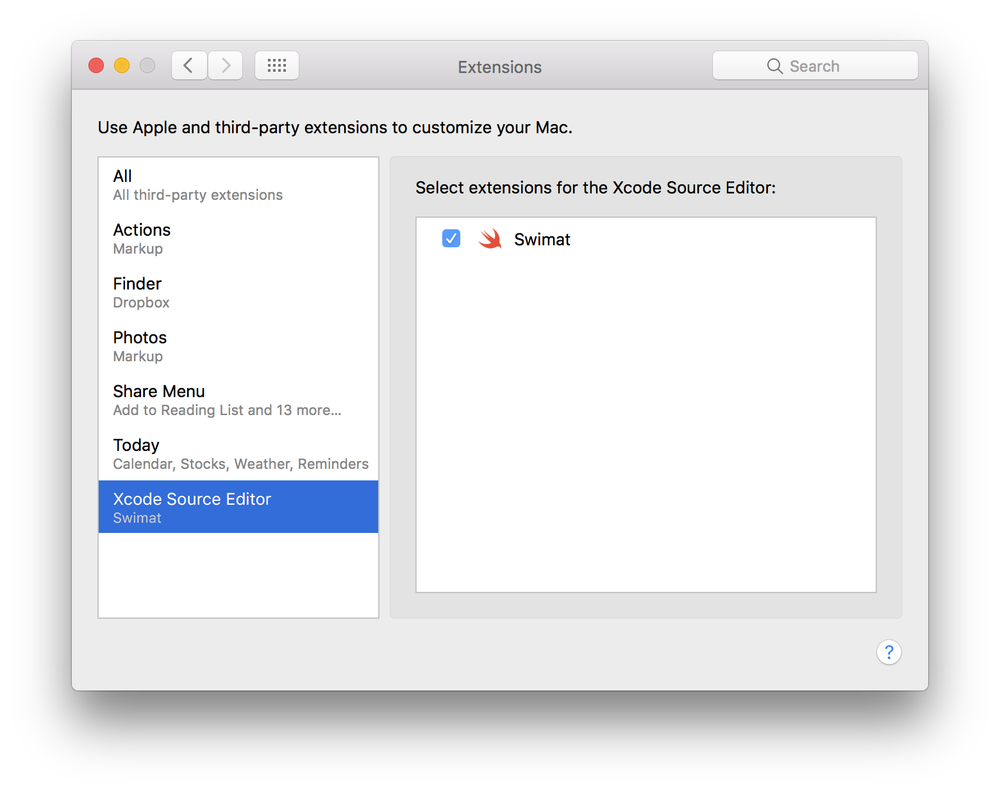

# Swimat

[](https://travis-ci.org/Jintin/Swimat)
[](https://codeclimate.com/github/Jintin/Swimat)
[](https://github.com/matteocrippa/awesome-swift)
[](https://cocoapods.org/pods/Swimat)

Swimat is an Xcode plug-in to format your Swift code.

## Preview


## Installation

There are three way to install.

1. Install via [homebrew-cask](https://caskroom.github.io/)

  ```bash
  brew cask install swimat
  ```

2. Download the App directly.<br>
  <https://github.com/Jintin/Swimat/releases/download/v1.3.5/Swimat.zip>

3. Clone `extension` branch and archive to Mac App.

## Usage

**After installation, you should open the `Swimat.app` once to make the functionality works.**

In the menu open **[Editor] -> [Swimat] -> [Format]** or map it to a hot-key you like in Xcode's Key Binding preferences.

## TroubleShooting

Check [System Preferences] -> [Extensions] -> [Xcode Source Editor] -> [Swimat] is checked. 

## Contributing

Bug reports and pull requests are welcome on GitHub at <https://github.com/Jintin/Swimat>.

## License

The module is available as open source under the terms of the [MIT License](http://opensource.org/licenses/MIT).
