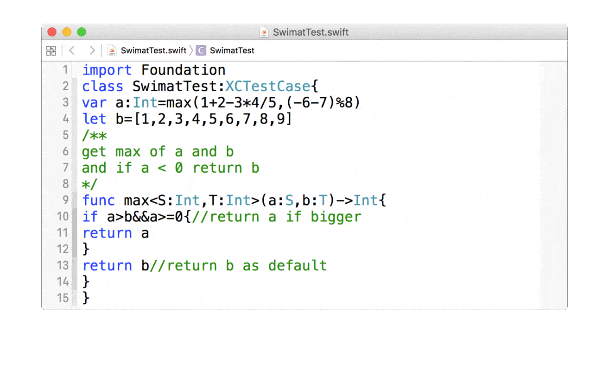
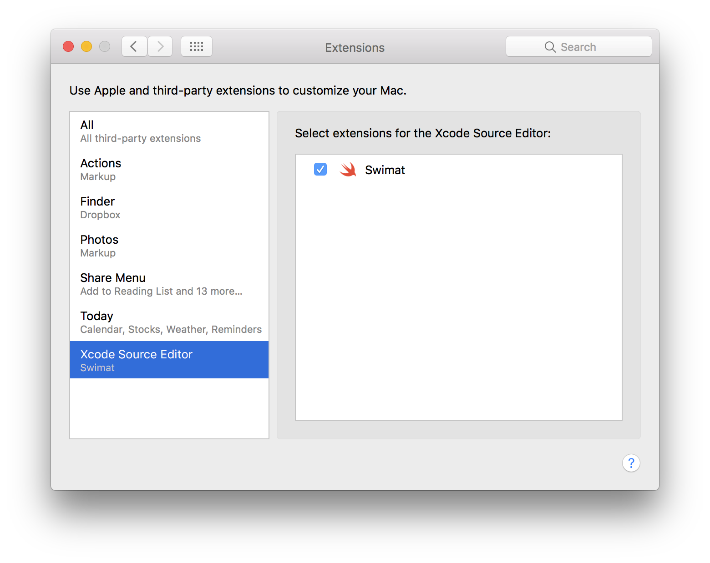

# Swimat

> ## ⚠️ This project is archived and no longer maintained.
>
> Swimat was built in 2015, when Xcode had no built-in way to format Swift code. That is no longer true — **Xcode now ships Apple's [`swift-format`](https://github.com/swiftlang/swift-format) as a first-party feature**, available under **Editor → Structure → Format File**.
>
> **If you're looking for a replacement:**
>
> | Need | Use |
> |---|---|
> | Format inside Xcode | **Editor → Structure → Format File** (built in) |
> | A configurable Xcode extension | [SwiftFormat for Xcode](https://github.com/nicklockwood/SwiftFormat#xcode-source-editor-extension) — `brew install --cask swiftformat-for-xcode` |
> | Formatting in CI / pre-commit | [SwiftFormat](https://github.com/nicklockwood/SwiftFormat) or [swift-format](https://github.com/swiftlang/swift-format) |
> | Linting | [SwiftLint](https://github.com/realm/SwiftLint) |
>
> The last release (1.7.0) no longer passes Gatekeeper and the Homebrew cask is being disabled. Please migrate to one of the options above.
>
> Swimat's formatter is a hand-written character scanner, which cannot correctly handle Swift features added since ~2020 — regex literals, custom operators, and nested block comments can be corrupted. The tools above are built on `swift-syntax` and do not have this class of bug.
>
> Thank you to the 1,600+ people who starred this, the 90+ who forked it, and everyone who filed an issue or sent a patch over the past decade. — [@Jintin](https://github.com/Jintin)

[](https://travis-ci.org/Jintin/Swimat)
[](https://www.codacy.com/app/Jintin/Swimat?utm_source=github.com&amp;utm_medium=referral&amp;utm_content=Jintin/Swimat&amp;utm_campaign=Badge_Grade)
[](https://github.com/matteocrippa/awesome-swift)

[](https://github.com/Jintin/Swimat/releases/latest)
[](https://caskroom.github.io/)

Swimat is an Xcode plug-in to format your Swift code.

## Preview



## Installation

There are three way to install.

1. Install via [homebrew-cask](https://caskroom.github.io/)

  ```bash
  # Homebrew previous version
  brew cask install swimat
  ```
  ```bash
  # Homebrew latest version
  brew install --cask swimat
  ```

2. Download the App directly.<br>
  <https://github.com/Jintin/Swimat/releases/download/1.7.0/Swimat.zip>

3. Clone and archive to Mac App by yourself.

## Usage

**After installation, you should open the `Swimat.app` once to make the functionality works.**

In the Xcode menu click **[Editor] -> [Swimat] -> [Format]** then the current active file will reformat.

You can also create a hot-key in **[Xcode] -> [Preferences..] -> [Key Bindings]**, if you don't have any prefernce you can set as <kbd>⌘</kbd> + <kbd>⇧</kbd> + <kbd>L</kbd>.

## TroubleShooting

Check [System Preferences] -> [Extensions] -> [Xcode Source Editor] -> [Swimat] is checked. 

## Contributing

Bug reports and pull requests are welcome on GitHub at <https://github.com/Jintin/Swimat>.

## License

The module is available as open source under the terms of the [MIT License](http://opensource.org/licenses/MIT).
